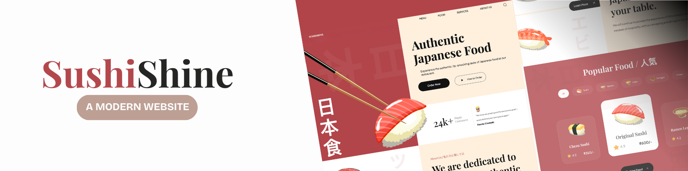

# SushiShine


<div align="center">
    
    
</div>

Welcome to **Sushi Shine**, a beautifully designed sushi website showcasing popular food, trending sushi items, and drinks. This project was built as part of my **web development portfolio** to demonstrate my skills in **HTML**, **CSS**, and responsive design techniques.

📋 Table of Contents

- [🤖 Introduction](#-introduction)
- [⚙️ Tech Stack](#-tech-stack)
- [🔋 Features](#-features)
- [🤸 Quick Start](#-quick-start)
- [🔗 Live Link](#-live-link)

---

## 🤖 Introduction

**Sushi Shine** is a visually appealing website designed to highlight popular sushi dishes and drinks. The project focuses on creating a modern, responsive design with smooth animations, clean layouts, and user-friendly navigation. This project demonstrates my ability to build static websites using **HTML**, **CSS**, and **Vite**.

---

## ⚙️ Tech Stack

- HTML 5
- CSS 3
- Vite

---

## 🔋 Features

👉 **CSS Variables:** Ensures a consistent and easily adjustable styling approach across the website.

👉 **Modular CSS:** CSS files are split into reusable components for better organization and maintainability.

👉 **Flexbox and Positioning:** Used extensively to create responsive layouts and visually balanced sections.

👉 **Smooth Animations:** Subtle animations enhance user experience, creating visually appealing transitions.

👉 **BEM Methodology:** The project follows the **Block Element Modifier (BEM)** naming convention for CSS classes, ensuring a structured and maintainable codebase.

👉 **Responsive Design:** The website is fully responsive across all devices, ensuring a seamless experience on desktops, tablets, and mobiles.

👉 **Organized File Structure:** Follows a clean and organized directory structure for easy navigation.

### Sections Included

- Navigation Bar
- Creative Hero Section
- About Us Section
- Popular Food, Trending Sushi, and Drinks Sections
- Newsletter Signup Section
- Footer Section

---

## 🤸 Quick Start

Follow these steps to set up the project locally on your machine.

### Prerequisites

Make sure you have the following installed:

- Git
- Node.js
- npm (Node Package Manager)

### Install Dependencies

To install all the required project dependencies, run:

```bash
npm install
```

### Run the Project

```bash
npm run dev
```
Open http://localhost:5173 in your browser to view the project.

---

## 🔗 Live Link  
[Live Website](https://sushishine.netlify.app/)

---

## 👨‍💻 About the Developer
This project is part of my personal portfolio, showcasing my skills in HTML, CSS, and responsive web design.

<div style="border: 1px solid #ddd; padding: 10px; border-radius: 5px; background-color: #f9f9f9;" align="center">
<strong>End Note</strong>  
Thank you for visiting this project! Your feedback, suggestions, and contributions are always welcome.
</div>
